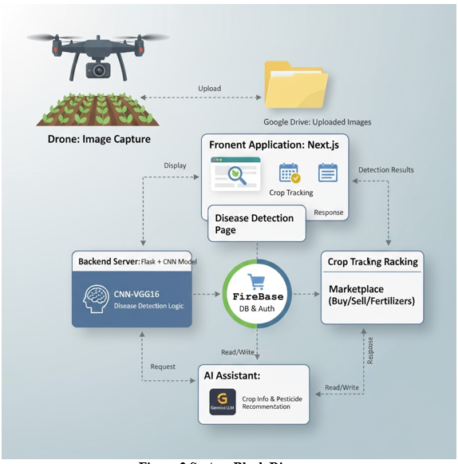
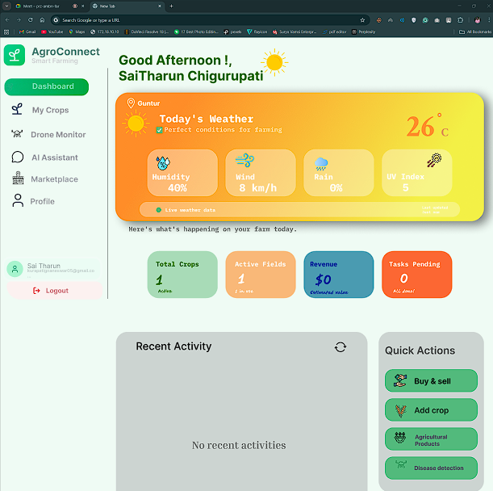
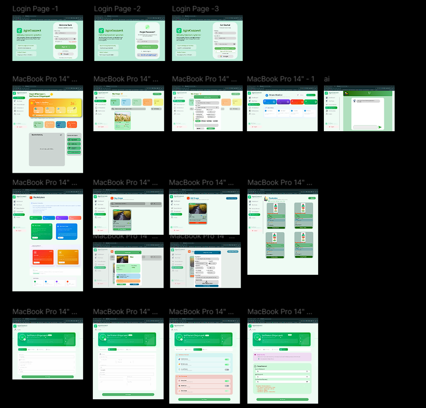
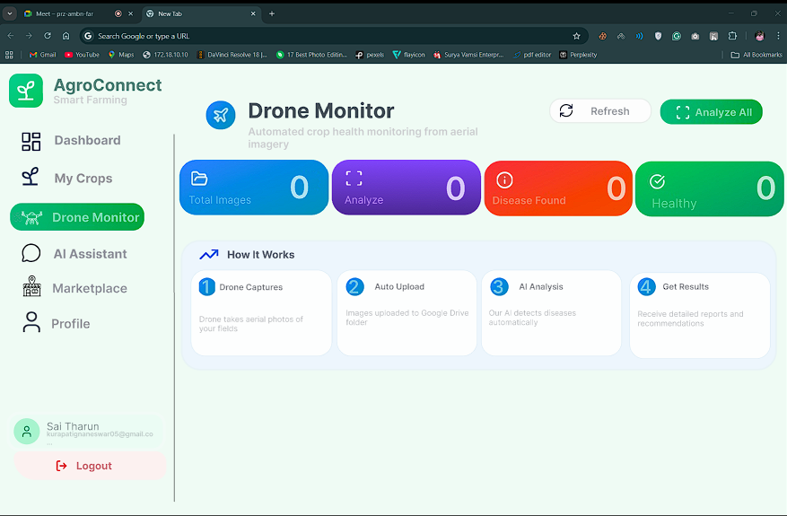

# AgroConnect: AI-Driven Smart Agriculture System

## Overview
AgroConnect is an AI-powered smart agriculture platform that leverages drone-based imaging, deep learning, and cloud technologies to automate crop disease detection and provide actionable recommendations to farmers.

This project integrates IoT, AI/ML, and full-stack development to address real-world agricultural challenges such as delayed disease detection, lack of expert guidance, and inefficient supply chains.

---

## 🚀 Key Features
- Drone-based real-time crop monitoring
- CNN (VGG16) based disease detection
- Flask backend for ML inference
- Next.js frontend dashboard
- Firebase authentication & real-time database
- Gemini AI chatbot for crop guidance
- Integrated agriculture marketplace

---

## 🧠 Tech Stack

**Frontend:** Next.js, React  
**Backend:** Flask (Python)  
**AI/ML:** CNN (VGG16), TensorFlow  
**Database:** Firebase (Auth + Firestore)  
**Cloud & APIs:** Google Drive API, Gemini API  

---

## 🏗️ System Architecture

---

## ⚙️ How It Works

1. Drone captures crop images from the field  
2. Images are uploaded to cloud storage (Google Drive)  
3. Flask backend retrieves and processes images  
4. CNN model predicts crop disease  
5. Results are displayed on the web dashboard  
6. Farmers receive recommendations via chatbot and marketplace  

---

## 📊 Results

- Disease detection accuracy: **~80–81%**
- Real-time prediction pipeline
- Automated disease identification and recommendation system

---

## 📸 Screenshots

### Dashboard

### UI Overview

### Drone Image Capture

---

## 🧪 Project Structure

---
## 🌍 Real-World Impact

- Reduces manual crop inspection effort  
- Enables early disease detection  
- Helps farmers make data-driven decisions  
- Reduces dependency on middlemen through marketplace integration
  
## ⚡ Key Highlights

- End-to-end AI + IoT system implementation  
- Real-world agriculture use case  
- Integration of ML, cloud, and web technologies  
- Scalable architecture for future deployment  

---

## 🔮 Future Improvements

- Improve model accuracy and generalization  
- Real-time drone streaming integration  
- Expand support for multiple crops and datasets  
- Mobile application support  

---

## 📌 Note

This project was developed as part of an academic capstone project and demonstrates the practical application of AI and IoT in modern agriculture systems.
